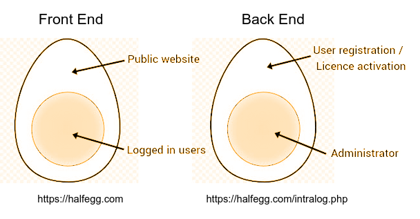

# halfegg
Complete registration / licensing web aplication
Half Egg ~ Complete user registration & licensing system

Este sistema permite crear licencias desde un panel de administrador, lo que genera un enlace que el usuario/cliente usará posteriormente para registrar su cuenta, activar su licencia y tener acceso a la sección reservada para usuarios registrados en el sitio web.

!  Este software está en etapa de desarrollo y no ha sido probado en producción todavía, espero que puedas involucrarte con el proyecto y aportar tus conocimientos.

## 1_ Los dos “medios huevos” de halfegg:

### 1.1 Descripción

El nombre “halfegg” (medio huevo) hace referencia a que el sistema se divide en dos partes, cada una de estas a la vez tiene una parte oculta en su interior.

Las dos capas de cada medio huevo están aseguradas mediante una cadena de validaciones que toman valores desde la base de datos y desde variables de sesión a la vez que mediante parámetros de la URL, combinando en una fuerte y sólida validación de usuario.

Al mismo tiempo, cada uno de los “medios huevos” se alojan en distintas urls, la parte del FRONT END está en el `http://dominio.com/index.php`, mientras que la parte BACK END se encuentra en otra url diferente, `http://dominio.com/intralog.php`

De está forma, el sistema de registro de usuarios/panel de administrador se encuentran totalmente separados del sitio web en sí mismo. 

Una vez el usuario es registrado desde el BACK END, ya no es posible acceder al mismo, siendo redireccionado al FRONT END.

### 1.2 FRONT END: 

El sitio web en sí mismo, en donde la capa externa serían las páginas públicas. Y el núcleo interno solo accesible para los usuarios registrados, bloqueado para los usuarios no registrados.

### 1.3 BACK END:  

El sistema de registro de usuarios, es decir, la página de activación de cuenta. Esto representa la capa externa del medio huevo. Mientras que la parte oculta sería el panel de administración, desde donde el admin/webmaster puede crear las licencias y realizar otras operaciones reservadas solo para el administrador.

   Front End                    Back End
    https://halfegg.com                     https://halfegg.com/intralog.php

## 2_ Configuración Inicial

### 2.1 Base de Datos

Para poner el sistema en funcionamiento, es necesario crear una base de datos MySQL, recomiendo usar phpMyadmin para crear la base de datos, viene integrado con todos los servidores locales. 

Nombre de la base de datos = “halfegg”

Está base de datos tendra tendra 3 tablas:

users, licencias y options

### 2.1.1 Tablas

**2.1.1.1 Tabla USERS - columnas**

INSERT INTO `users` (
`id`, 
`lic_id`, 
`nombre`,
 `email`, 
`contrasena`,
 `role`, 
`last_action`, 
`hash`)

**2.1.1.2 Tabla LICENCIAS - columnas**

INSERT INTO `licencias` (
`id`, 
‘status’,
‘email’,
`last_action`
)

**2.1.1.3 Tabla options** - No es necesario crear está tabla para la configuración inicial

### 2.1.2 Crear admin

Tabla user, crear registro: 
$string = “tuNombre”,$email=”tuEmail”,$pasword=”tuContraseña”

`id`, = 1
`lic_id`, = 1
`nombre` =$string
 `email` =$email, 
`contrasena`=$pasword,
 `role`=”admin”, 
`last_action`=”TimeStamp”, 
`hash`=NULL)

Tabla Licencias. crear registro

`id`=1, 
‘status=-1’,
‘email’=NULL,
`last_action=TIMESTAMP`

## 2.2 Tipos de usuarios:

### 2.2.1 Admin
### 2.2.2 Usuario no registrado
### 2.2.3 Usuario registrado
### 2.2.4 Tipo de licencia

## 2.3 Archivos

### 2.2.1 Instalación en servidor
### 2.2.2 Conectar con la base de datos

## 2.4 Mapa de archivos:

__log
__incs
__class-expiration.php
__class-registration_link.php
__class-validate_back.php
__class-log_back.php
__class-log_main.php
__mod
__incs/
    __class-client_login.php
    __class-form_validate.php
    __class-mod_db.php
    __class-session_autostart.php
__class-mod_back.php
__class-mod_main.php

__view
    __incs
        __class-back_toggle.php
    __scripts
        __CSS
            _main-style.css
        __JS
            __il_main.js            
    __templates
        __ 13 more template files open here
    __class-view_back.php
    __class-view_reg.php
    __class-view_main.php

config.php
index.php
intralog.php
README.md

3_ Funcionamiento

3.1 Antes de empezar
3.2 Acceso a panel administrador
3.3 Registro de usuarios 
3.4 Sistema de licencias 
3.5 Páginas reservadas a usuarios registrados
3.6 Sitio Web 

4_ LOG

4.1_ Versiones

halfegg-0.0.2
Sistema de LOGIN LOGOUT mediante variable de sesion
sesion autostart
sesion expiration
formulario de login
Crea datos y los inserta en la sesión 
Valida nombre&psw user con BBDD
formulario de registro
pagina de redirección si el usuario tiene licencia activa
dashboard de admin
boton de logout

4.2_ Desarrollo
4.2.1 _ En curso

halfegg-0.0.4
Agregar hash a base de datos y validar con hash de sesion
4.2.2 _ En la lista

halfegg-0.0.4
Agregar hash a base de datos y validar con hash de sesion

4.2.3 _ Bugs

5_ FAQ

